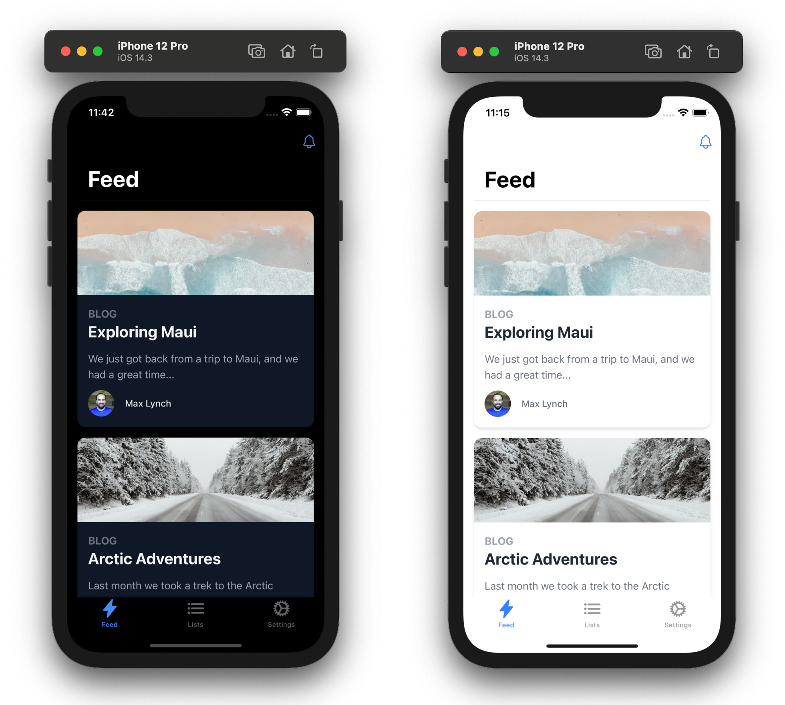
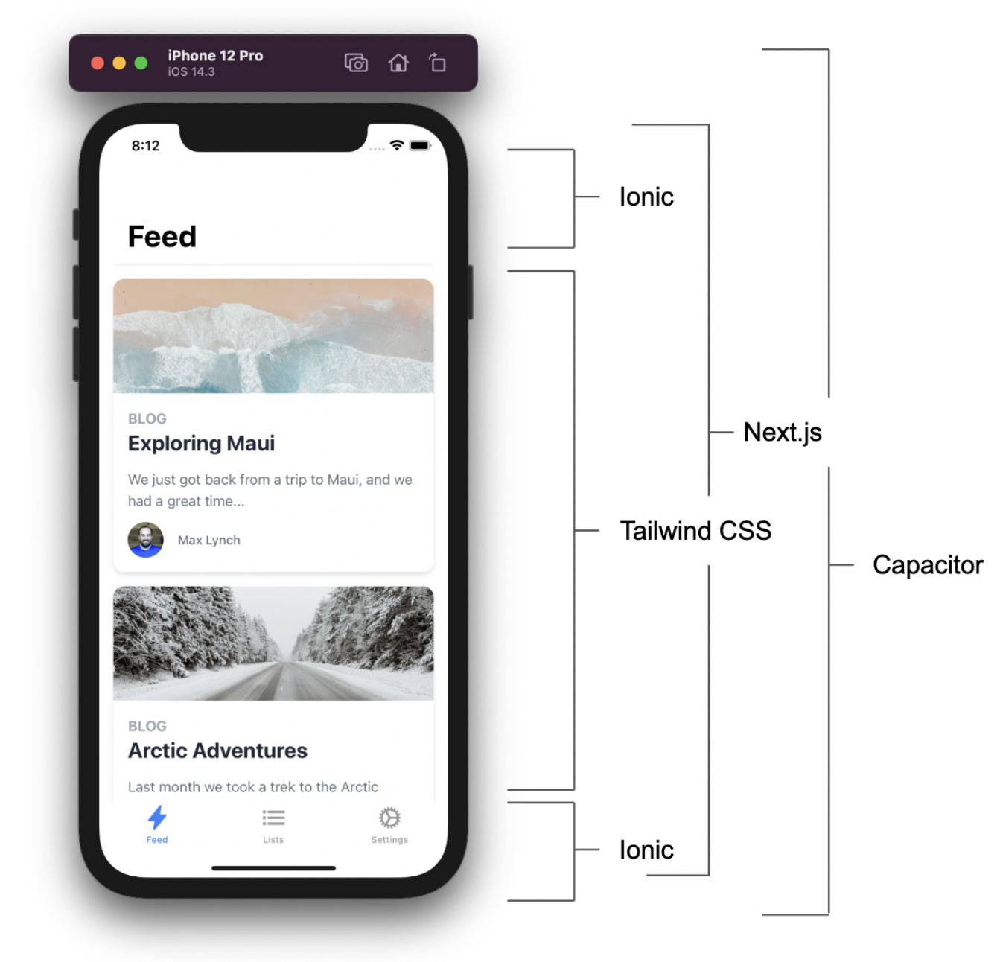

# Next.js + Tailwind CSS + Ionic Framework + Capacitor Mobile Starter

## Giới thiệu
Dự án này là một điểm khởi đầu khái niệm cho việc xây dựng ứng dụng iOS, Android, và Progressive Web App với Next.js, Tailwind CSS, Ionic Framework, và Capacitor.

Next.js xử lý trải nghiệm ứng dụng React ở môi trường sản xuất, Tailwind được sử dụng để thiết kế giao diện của từng trang trong ứng dụng của bạn, Ionic Framework cung cấp các điều khiển hệ thống đa nền tảng (điều hướng/chuyển đổi/tab/v.v.), và sau đó Capacitor gói gọn tất cả và chạy trên iOS, Android, và Web với đầy đủ quyền truy cập native.

Xem bài đăng blog này để biết tổng quan về ngăn xếp công nghệ và cách nó hoạt động: https://dev.to/ionic/build-mobile-apps-with-tailwind-css-next-js-ionic-framework-and-capacitor-3kij

## Cách sử dụng
Dự án này là một ứng dụng Next.js tiêu chuẩn, vì vậy quy trình phát triển Next.js tiêu chuẩn được áp dụng (npm run dev để phát triển dựa trên trình duyệt). Tuy nhiên, có một điều cần lưu ý: ứng dụng phải được xuất để triển khai trên iOS và Android, vì nó phải chạy hoàn toàn trên phía client (thêm về xuất Next.js).

Để xây dựng ứng dụng, chạy:

bash
Sao chép mã
npm run build
Tất cả các tệp phía client sẽ được gửi đến thư mục ./out/. Những tệp này cần được sao chép vào các dự án iOS và Android native, và đây là nơi Capacitor hỗ trợ:

bash
Sao chép mã
npm run sync
Cuối cùng, sử dụng các lệnh chạy sau để chạy ứng dụng trên mỗi nền tảng:

bash
Sao chép mã
npm run ios
npm run android
## Livereload/Instant Refresh
Để kích hoạt Livereload và Instant Refresh trong quá trình phát triển (khi chạy npm run dev), tìm địa chỉ IP của giao diện local của bạn (ví dụ: 192.168.1.2) và cổng mà máy chủ Next.js của bạn đang chạy, sau đó đặt giá trị cấu hình url của máy chủ để chỉ đến nó trong capacitor.config.json:

json
Sao chép mã
{
  "server": {
    "url": "http://192.168.1.2:3000"
  }
}
Lưu ý: cấu hình này sẽ dễ dàng hơn trong Capacitor 3 đã mới đi vào beta.

## Các API Routes
Các API Routes có thể được sử dụng nhưng cần một số cấu hình tối thiểu. Xem thảo luận này để biết thêm thông tin.

Lưu ý
Một lưu ý với dự án này: Bởi vì ứng dụng phải có thể chạy hoàn toàn trên phía client và sử dụng lệnh Export của Next.js, điều đó có nghĩa là không có Server Side Rendering trong mã nguồn này. Có lẽ có cách để SSR và một ứng dụng Next.js tĩnh hoàn toàn song song nhưng nó yêu cầu một plugin Babel hoặc sẽ liên quan đến một thiết lập monorepo phức tạp hơn với chia sẻ mã mà vượt ra ngoài phạm vi của dự án này.

Ngoài ra, định tuyến Next.js thực sự không được sử dụng nhiều trong ứng dụng này ngoài một đường dẫn bắt kịp để hiển thị khung ứng dụng native và tham gia vào Đường dẫn Router Ionic React. Điều này chủ yếu là do định tuyến Next.js không được thiết lập để kích hoạt các chuyển đổi và quản lý trạng thái lịch sử kiểu native như loại Ionic sử dụng.

## Capacitor là gì?
Bạn có thể nghĩ về Capacitor như là một "electron cho di động" chạy các ứng dụng web tiêu chuẩn trên iOS, Android, Desktop, và Web.

Capacitor cung cấp quyền truy cập vào các API Native và một hệ thống plugin để xây dựng bất kỳ chức năng native nào mà ứng dụng của bạn cần.

Các ứng dụng Capacitor cũng có thể chạy trong trình duyệt như một Progressive Web App với cùng mã nguồn.

## Ngoài lề
npm run build (Update static file "out")
npx cap copy ios (Update Application)
npx cap open ios (Open Build Application)
